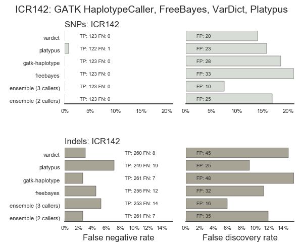

# ICR142 validation in bcbio

Support running an ICR142 validation using [bcbio](https://github.com/chapmanb/bcbio-nextgen)

http://f1000research.com/articles/5-386/v1

# Running validation

This repository contains a full set of configuration files and BED/VCF
validation sets to run an analysis with bcbio:

1. Obtain the
   [ICR142 fastq files](https://www.ebi.ac.uk/ega/datasets/EGAD00001001462),
   which require [applying for access](http://www.icr.ac.uk/icr142). Move these
   to `bcbiorun/input/fastqs`

2. Run the analysis using an
   [installed version of bcbio](http://bcbio-nextgen.readthedocs.io/en/latest/contents/installation.html).
   This can run on
   [a single machine using multiple cores or distributed on a cluster](http://bcbio-nextgen.readthedocs.io/en/latest/contents/parallel.html):
   ```
   cd bcbiorun/work
   bcbio_nextgen.py ../config/icr142.yaml -n 16
   ```

3. Summarize and plot the results:
   ```
   cd ../summarize
   bcbio_python ../../scripts/combine_samples.py
   bcbio_python ../../scripts/bcbio_validation_plot.py icr142-summary.csv
   ```

# Results

Validation using bwa-mem and 3 variant callers (GATK HaplotypeCaller, FreeBayes
and VarDict):



# Truth set preparation

We prepared the truth set and analysis regions using the truth set calls from
[Supplemental table 1](http://f1000research.com/articles/5-386/v1):
`scripts/icr_to_vcf.py` created the VCF and BED files contained in the
repository from the original table and a list of variants found to be homozygous
(both in `bcbiorun/input`). The initial truth table does not have information
about whether exepcted variants are homozygous or heterozygous so we ran an
intial validation with everything heterozygous, then used
`scripts/find_hethomerrors.py` to find those variants that are likely homozygous
to reprepare the final truth set.
